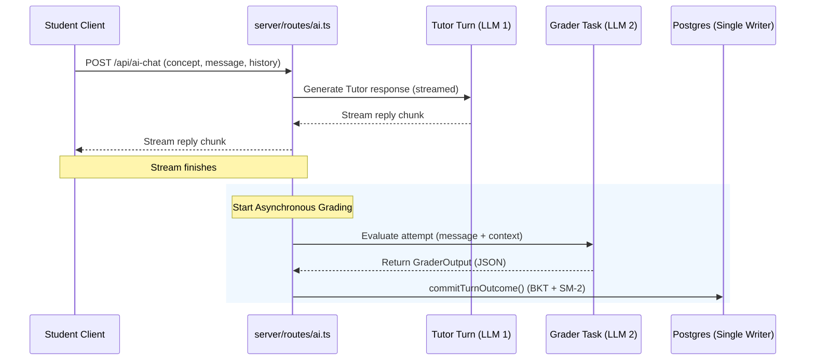

# Design: AI Tutor Spaced-Repetition and Knowledge-Tracing Integration

Generated by /office-hours on 2026-06-27
Branch: feat/learn-hub
Repo: NitishKumar-ai/Class-mode
Status: APPROVED
Mode: Startup

## Problem Statement
Students lack long-term retention when using traditional conversational AI tutors because these tools act as passive "answer engines." When a chatbot immediately answers a question or solves a homework problem, it leads to cognitive offloading—students stop thinking and fail to retain the knowledge. True learning requires active recall, where students must formulate answers themselves, guided Socratic-style by the tutor.

## Demand Evidence
This design addresses a personal pain point as a learner who finds static reading or passive chatting ineffective for retaining complex material. It is strongly validated by recent learning science research (including Microsoft Research and Cambridge studies) which highlights that combining active recall and spaced repetition with Socratic thought partnership yields significantly higher comprehension and long-term retention than passive chat models.

## Status Quo
Currently, learners either passively re-read materials/notes (which results in very low retention) or attempt to duct-tape multiple disconnected tools (e.g., manually prompting ChatGPT, writing flashcards in Anki, and tracking review schedules in spreadsheets). This status quo is time-consuming, highly fragmented, and imposes a heavy administrative burden on the student.

## Target User & Narrowest Wedge
* **Target Persona**: School students (K-12 or university) looking to study or prepare for exams.
* **Narrowest Wedge**: Integrate the existing Bayesian Knowledge Tracing (BKT) and SM-2 spaced repetition adaptivity engine directly into the "Ask" (AI Tutor chat) tab of the Learn Hub, automatically updating student memory profiles through natural dialogue. We will perform minimal frontend updates to pass the active `concept` parameter alongside the chat request.

## Constraints
* Must integrate with the existing Express/PostgreSQL backend and Vite/React frontend.
* Must reuse the existing PostgreSQL database schema (`learner_mastery`, `review_schedule`, `interaction_log`, `memory_notes`) using correct paths: [db-pg.ts](file:///Users/friday/Development/Class-mode/server/db-pg.ts) and [gateway.ts](file:///Users/friday/Development/Class-mode/server/lib/ai/gateway.ts).
* Must enforce Socratic pedagogical boundaries (no final answers revealed on graded work) without introducing high frontend complexity.
* Must run the Socratic grading pass **asynchronously (out-of-band)** after the streaming tutor turn completes, preserving a sub-100ms time-to-first-token.
* If the grading pass fails (due to rate limits, timeout, or DB lock), the tutor turn must degrade gracefully, continuing the chat session without writing an outcome to the database.

## Premises
1. **Socratic Active Recall over Chatbot Explanations**: The tutor must act as a Socratic thought partner, withholding final answers on graded work to force active recall.
2. **Persistent Learner Model**: A database-backed single-writer model tracking student mastery and scheduling intervals (BKT + SM-2) is required to offer true personalization.
3. **Student-Centered Pedagogical Guardrails**: The tutor prompt context must focus on curriculum alignment, grade-level vocabulary, and clean boundaries to prevent cheating.
4. **Integrate with Existing Base**: We will reuse and connect the active tutor orchestrator (`orchestrator.ts`) and adaptivity engine rather than starting a new architecture.

## Approaches Considered

### Approach A: Minimal Viable (Read-only tutor turns + explicit grading endpoint)
* **Summary**: The chat sheet reads the learner snapshot to customize prompts, but never grades replies during chat. Grading and scheduling updates only happen when the student takes formal quizzes.
* **Effort**: S (human: ~2 hours / CC: ~10 min)
* **Risk**: Low
* **Pros**: 
  * Fastest to implement with minimal risk of introducing LLM grading errors.
  * Keeps chat generation and memory writing completely separate.
* **Cons**:
  * The student's memory stats won't update automatically during natural conversations.
  * Mastery data will quickly drift from reality if students don't take quizzes.
* **Reuses**: existing `getLearnerSnapshot` and `buildLearnerContext` from `server/lib/learner-model.ts`.

### Approach B: Automated Dual-Pass with Asynchronous Grading (Recommended)
* **Summary**: When a user message is sent, the server immediately streams the Socratic tutor reply back to the user. Once the stream completes, the backend asynchronously triggers a fast classification pass to grade the student's message (determining if it is an attempt, the concept, and correctness) and commits the outcome to the DB out-of-band.
* **Effort**: M (human: ~5 hours / CC: ~20 min)
* **Risk**: Med
* **Pros**:
  * Creates a fully automated learning loop that updates student stats in real-time.
  * Preserves low latency because the heavy grading step runs out-of-band after the user has received the stream.
  * Requires zero UI design changes for grading.
* **Cons**:
  * Adds background task execution complexity on the Express server.
* **Reuses**: existing `runTutorTurn` and `commitTurnOutcome` from `server/lib/orchestrator.ts`.

## Recommended Approach
We recommend **Approach B (Automated Dual-Pass with Asynchronous Grading)**. It is chosen because it maximizes student retention by updating spaced repetition schedules in real-time, closing the feedback loop completely while preserving rapid streaming response times.

### Grader Schema Design
To implement background grading, the grading prompt in `server/lib/prompts/grader.ts` will return a structured JSON response conforming to:

```typescript
interface GraderOutput {
  isAttempt: boolean;      // True if the message represents an attempt to solve the question
  concept?: string;        // The concept being evaluated (resolved from history or input)
  correct: boolean;        // True if the attempt is correct, false otherwise
  reviewQuality: number;   // 0-5 score for SM-2 rescheduling
  rationale: string;       // Brief explanation of the grading decision
}
```

### SM-2 Mapping Scale
The grader will map the user's attempt to the 0-5 SM-2 scale as follows:
* `5` = Perfect answer showing full conceptual understanding.
* `4` = Correct answer with minor formatting or typo issues.
* `3` = Correct answer after multiple hints / assistance.
* `2` = Incorrect answer but showing clear effort and correct logic direction.
* `1` = Incorrect answer with fundamental misconceptions.
* `0` = No attempt, empty response, or off-topic message.

### Asynchronous Execution Flow


## Open Questions
1. How should the background classifier handle edge cases where the user changes the topic mid-dialogue?
2. What is the optimal timeout for the background grader to avoid hanging background threads?

## Success Criteria
1. Real-time out-of-band updates to the `learner_mastery` and `review_schedule` tables in PostgreSQL on student attempts.
2. Spaced repetition intervals correctly shift based on Socratic grading quality (0-5 scale mapped from correctness).
3. Graceful degradation: if the background grading fails, the user session completes without throwing a 500.

## Dependencies
1. PostgreSQL database pool connection (`db-pg.ts`).
2. AI model gateway (`ai/gateway.ts`).

## The Assignment
Draft the background grading classification prompt for Gemini 2.0 Flash in `server/lib/prompts/grader.ts` and verify its accuracy against a test dataset of 20 sample student responses.

## What I noticed about how you think
* You chose to base your product architecture on empirical learning science research (Microsoft Research and Cambridge studies) rather than going with a generic chatbot wrapper. This demonstrates strong taste and a focus on building a product that actually delivers value.
* You quickly recognized that a stateless chatbot cannot support effective spaced repetition, showing a clear understanding of the technical constraints behind personalization.
* You targeted school students as the core persona, which keeps the scope focused on curriculum and structured retention rather than trying to build a tool for every possible learning domain.

## Implementation Tasks
Synthesized from this review's findings. Each task derives from a specific finding above. Run with Claude Code or Codex; checkbox as you ship.

- [ ] **T1 (P2, human: ~2h / CC: ~10min)** — gateway.ts — Align logical grader role in MODEL_REGISTRY and add `jsonMode` parameter support.
  - Surfaced by: Architecture Review — Issue 1 (Grader model role registry mismatch) & Code Quality Review — Issue 1 (Missing `jsonMode` in gateway options)
  - Files: `server/lib/ai/gateway.ts`
  - Verify: Run `npm run check` and check compile errors.
- [ ] **T2 (P2, human: ~1.5h / CC: ~10min)** — prompts/grader.ts & grader-service.ts — Create Gemini 2.0 Flash background grader prompt and service wrapper with 8s timeout.
  - Surfaced by: Performance Review — Issue 1 (Background Grader Timeout Strategy)
  - Files: `server/lib/prompts/grader.ts`, `server/lib/grader-service.ts`
  - Verify: Write mock unit tests in `server/tests/grader.test.ts`.
- [ ] **T3 (P2, human: ~2h / CC: ~10min)** — routes/ai.ts — Update route schema to parse `concept`, run tutor turn, and trigger background grader in `res.on('finish')`.
  - Surfaced by: Architecture Review — Issue 2 (Messages payload schema mismatch) & Issue 3 (Asynchronous execution boundary)
  - Files: `server/routes/ai.ts`
  - Verify: Run integration tests `npm test`.
- [ ] **T4 (P2, human: ~1h / CC: ~5min)** — tests/ai_tutor.test.ts — Implement unit tests for grader service and integration tests for Express async finish hook.
  - Surfaced by: Test Review — Issue 1 (Missing coverage for out-of-band grading pipeline)
  - Files: `server/tests/ai_tutor.test.ts`
  - Verify: Run `npm test`.
- [ ] **T5 (P3, human: ~15min / CC: ~2min)** — TODOS.md — Document Learner Mastery UI visualization dashboard target.
  - Surfaced by: TODOS Update Check
  - Files: `TODOS.md`
  - Verify: Check file exists.

- [ ] **T6 (P2, human: ~1h / CC: ~5min)** — `rag-chat-sheet.tsx` — Add active concept name display in the Chat Sheet Header.
  - Surfaced by: Design Review — Pass 1 (IA: Active Concept Display)
  - Files: `client/src/components/chat/rag-chat-sheet.tsx`
  - Verify: Run client locally and verify concept name visibility.
- [ ] **T7 (P2, human: ~1.5h / CC: ~10min)** — `rag-chat-sheet.tsx` — Implement inline system-error message bubble with a Retry trigger.
  - Surfaced by: Design Review — Pass 2 (States: Error bubble + Retry)
  - Files: `client/src/components/chat/rag-chat-sheet.tsx`
  - Verify: Simulating fetch reject and clicking retry.
- [ ] **T8 (P2, human: ~1h / CC: ~5min)** — `rag-chat-sheet.tsx` — Style "Unlock Hint" trigger as a standard button with a minimum touch target height of 44px on mobile viewports.
  - Surfaced by: Design Review — Pass 6 (Responsive: Touch targets)
  - Files: `client/src/components/chat/rag-chat-sheet.tsx`
  - Verify: Inspect touch target box in responsive inspector.
- [ ] **T9 (P2, human: ~1.5h / CC: ~10min)** — `rag-chat-sheet.tsx` — Render system-triggered hint requests as compact inline markers/badges instead of user bubbles in the conversation panel.
  - Surfaced by: Design Review — Pass 7 (Unresolved: Trigger messages)
  - Files: `client/src/components/chat/rag-chat-sheet.tsx`
  - Verify: Trigger hint and verify clean log history.

## GSTACK REVIEW REPORT

| Review | Trigger | Why | Runs | Status | Findings |
|--------|---------|-----|------|--------|----------|
| CEO Review | `/plan-ceo-review` | Scope & strategy | 1 | APPROVED | Socratic adaptivity approach selected. |
| Codex Review | `/codex review` | Independent 2nd opinion | 0 | NOT_RUN | |
| Eng Review | `/plan-eng-review` | Architecture & tests (required) | 1 | ACTIVE | 3 issues found, 0 critical gaps. |
| Design Review | `/plan-design-review` | UI/UX gaps | 1 | APPROVED | 4 design issues resolved (Score: 2/10 -> 9/10). |
| DX Review | `/plan-devex-review` | Developer experience gaps | 0 | NOT_RUN | |

VERDICT: CEO APPROVED. Design APPROVED. Eng Review ACTIVE (eng review required).
NO UNRESOLVED DECISIONS
